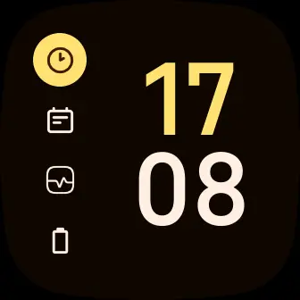
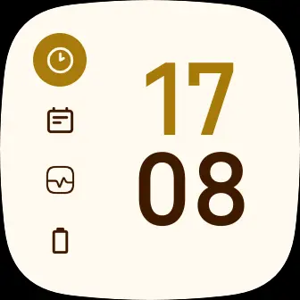

### Whiskers for [Fitbit](https://www.fitbit.com/global/us/home)

    
    

## 👷‍♂️ Install

1. Go to the clock gallery in your fitbit app or click [here](https://gallery.fitbit.com/details/275886dc-df2a-46e9-a781-69ec0891c36d) to open it in the website
2. Search for fitbit
3. Install and give all permissions

## 💻 Maintainers

- [lighttigerXIV](https://github.com/lighttigerXIV)
